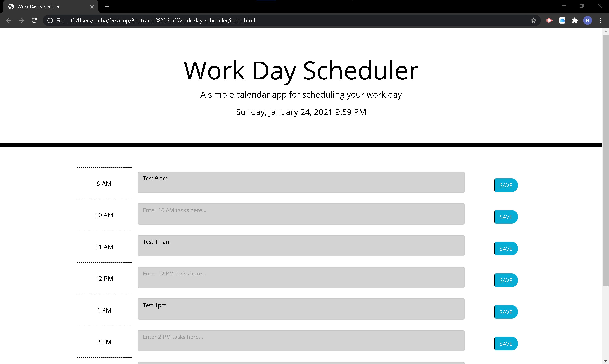

# Work Day Scheduler

This web application is a work day planner that allows the user to type out any tasks or reminders that they need throughout their standard work day.  There are 8 rows each designated to an hour in the 9am - 5pm business day.  In each row there are 3 sections (columns) with the hour, task description, and save button, respectively.  

The header displays the current date and time. Moment.js was used throughout this project to calculate date and time.  The display time function is then run repeatedly at an interval of half a second to ensure that the current time stays accurate.  

The "hour" column displays the hour designated for that row.  

When the user clicks on the textarea in the "description" column they are able to enter their description of that hours task or reminder.  

When the user clicks the save button, the value of the textarea is saved into local storage under a unique identifier.  When the page is reloaded the value of those storage items is populated into its designated textarea.   I have a version ready that clears local storage 24 hours after the last save is committed, but I did not merge that into the deployed project because it was not a feature that is included in the acceptance criteria.  

The textarea of hours in the past are color coded grey, the current hour is scarlett, and the hours in the future are coded green.  This effect was created by adding the previously created class .past, .present, or .future to the textarea.  The current time is compared against the hour for the time block to determine its class and color designation.  This function is then repeated at an interval of one second to keep the color designations current.

At the moment the CSS flexbox is not performing as expected, so veiwports under 780px will be skewed poorly with the save button wrapping halfway underneath the task description.  I presume this is some sort of interaction with Bootstrap and my starter code.  Hopefully I can figure that out so that the application is accesible on mobile.  Otherwise, the application's main functionality is solid so it meets the requirements of a MVP.

Here is a screenshot of the deployed application:

